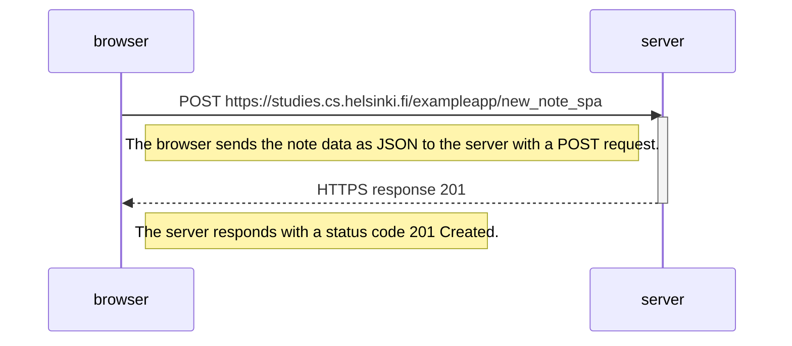

```mermaid
sequenceDiagram
    participant browser
    participant server
    browser->>server: POST https://studies.cs.helsinki.fi/exampleapp/new_note_spa
    activate server
    Note right of browser: The browser sends the note data as JSON to the server with a POST request.
    server-->>browser: HTTPS response 201
    deactivate server
    Note right of browser: The server responds with a status code 201 Created.

```
